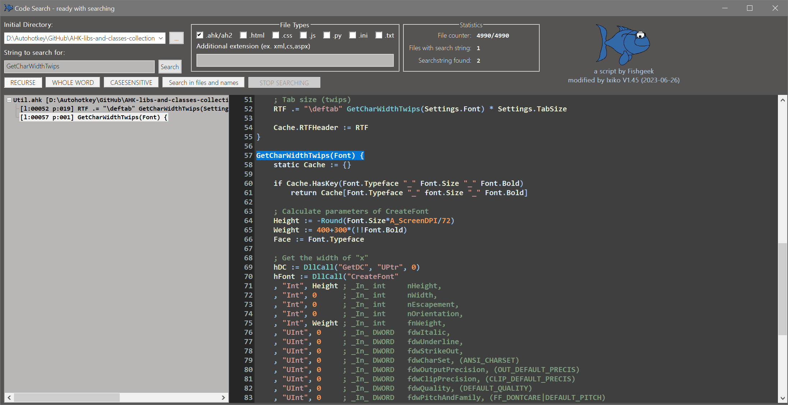

<h5>Original code from fishgeek / modified last on 28.08.2023 (V1.46) from Ixiko</h5>

<h4>Original text from fischgeek's repository</h4>

 Remember that bit of code you wrote, but can't remember exactly where you wrote it? 
Try using this tool to target a directory and search for a keyword inside of your code files.
 

<h4>AHK-CodeSearch I have made for <a href="https://github.com/Ixiko/AHK-libs-and-classes-collection">[AHK-libs-and-classes-collection]</a></h4>

#### *Autohotkey no longer enjoys my main attention, but I have yet to find anything better for finding program code on my computers than Fishgeek's codesearch program.  Other programs certainly achieve greater speed, but the foundation Fishgeek has laid and the ease with which further code highlighting can be integrated are unique.  The nicest thing is how few resources an AHK script consumes in contrast to e.g. Python, and just copying the entire Codesearch directory is enough to run the code.*

### ***<u>You still find bugs? Do you think there is still room for improvement? Then you are more than right!</u>***

# VERSION HISTORY

### V1.46

- Now you can enter a list of directories in which to search. The script determines the file endings contained in each directory. This allows you to include or exclude certain directories for the search to speed up the search.
- Empty chars like a 'c' or 'D' without anything else will be interpreted as device letter
- Highlighting for Python language and .ini files added
- additional file types can be entered and will included in search

### V1.45

- Displaying line numbers
- The gui colours have been adapted to the codestyle
- Fixed incorrect behaviour when resizing the Treeview and RichCode controls

### V1.44		

- Search in files and/or file names
- Added an RichCode (/Edit)-Control to show your found code highlighted
- class_RichCode.ahk got additional functions
- Removed the ListView for a TreeView control
- Click on a sub-item in TreeView and it scrolls into view!
- Add a context menu to the TreeView control with the options to Edit, Execute and Open Script Folder
- The width of TreeView and RichEdit-Control can be adjusted with a mouse drag in the gap between both controls
- Window position, size and the sizes of TreeView and RichCode control will be stored after closing the Gui

### V1.3

- Gui Resize for ListView control is working
- Showing the last number of files in directory
- Change the code to the coding conventions of AHK_L V 1.1.30.0
- Ready to enter the search string right after the start
- Pressing Enter after entering the search string starts the search immediately
- The buttons R, W, C now show their long names

### V1.2
- Stop/Resume Button is added - so the process can be interrupted even to start a new search
- a. from fischgeek Todo -  Find an icon - i take yours and it looks great!

### V1.1
- the window displays the number of files read so far and the number of digits found during the search process
- Font size and window size is adapted to 4k monitors (Size of Gui is huge - over 3000 pixel width) - at the moment, no resize or any settings for the size of the contents is possible - i'm sorry for that
