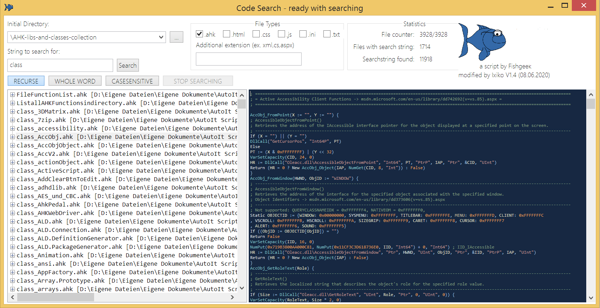

<h1>AHK-CodeSearch</h1>

<h5>Original code from fishgeek / modified last on 05.09.2019 (V1.3) from Ixiko</h5>

<h4>Original text from fischgeek's repository</h4>

Remember that bit of code you wrote, but can't remember exactly where you wrote it?
Try using this tool to target a directory and search for a keyword inside of your code files. 

  

my version look'a'like:

1. Ready to enter the search string right after the start
2. pressing Enter after entering the search string starts the search immediately
3. the buttons R, W, C now show their long name																	V1.1 - 03.03.2018
4. the window displays the number of files read so far and the number of digits found during the search process
5. Font size and window size is adapted to 4k monitors (Size of Gui is huge - over 3000 pixel width) - at the moment, no resize or
	any settings for the size of the contents is possible - i'm sorry for that
					V1.2 - 04.03.2018
6. Stop/Resume Button is added - so the process can be interrupted even to start a new search
	6.a. from fischgeek Todo -  Find an icon - i take your Github-Logo and it looks great!
7. Gui Resize for Listview control is working
8. showing the last number of files in directory
9. change the code to the coding conventions of AHK_L V 1.1.30.0

